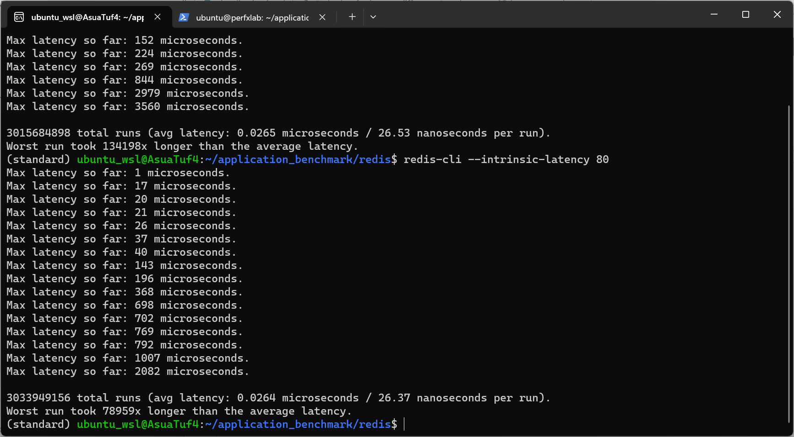
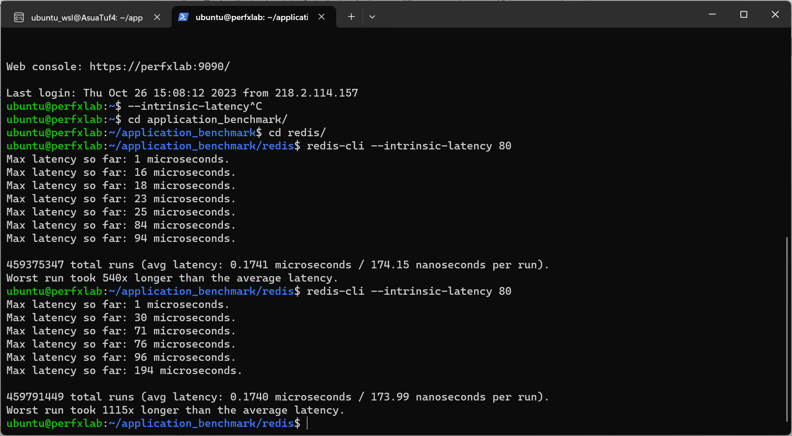
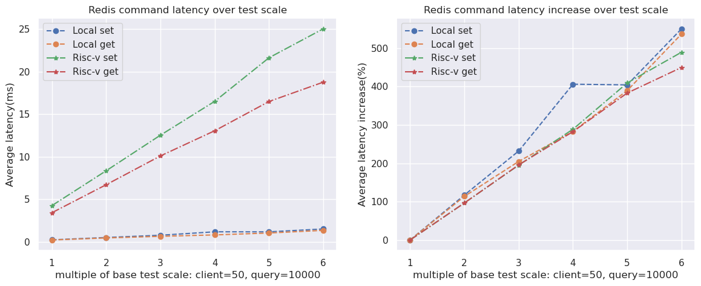
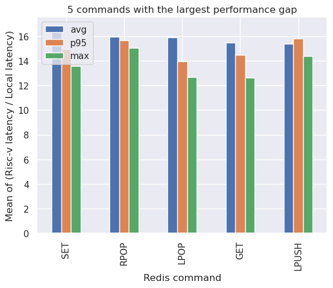
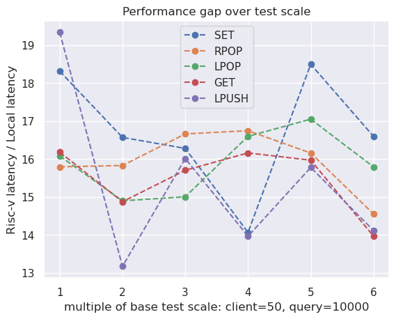
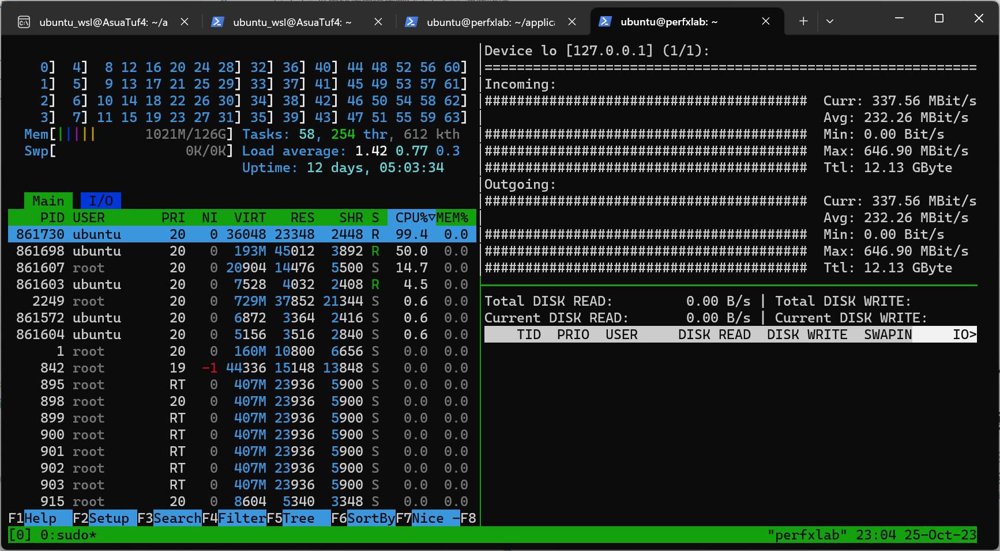
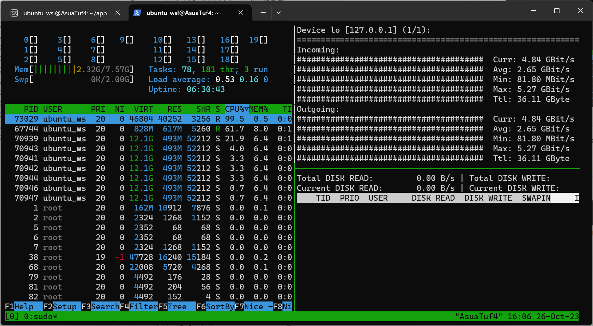
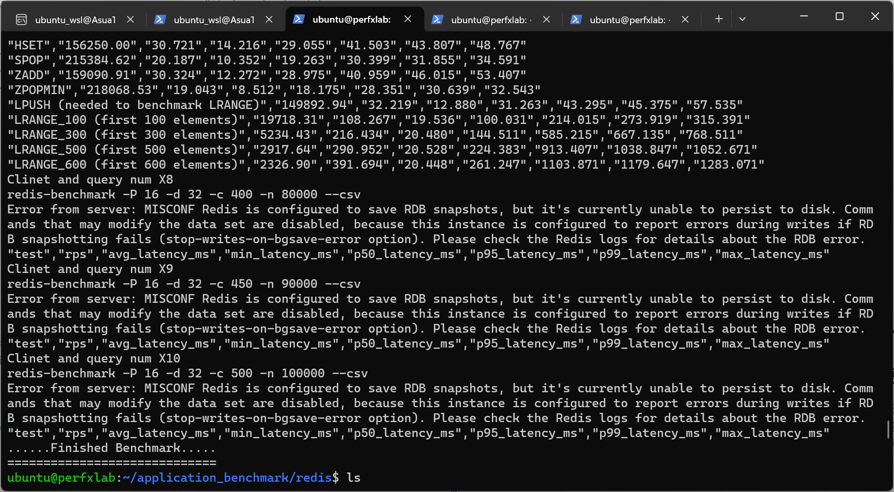

# Redis测试

## intrinsic latency

intrinsic latency是系统内部的延时，是运行Redis的环境固有的一部分，这是由操作系统内核提供的延迟，如果使用虚拟化，由正在使用的管理程序提供的延迟，[参考](https://redis.io/docs/management/optimization/latency/)。

简单测试一下。

本地（WSL环境）:

Risc-v服务器:

## Redis-benchmark

使用脚本测试多次，每次增大一倍的测试规模，基本的测试规模为：client=50,query=10000。

测一下get和set两个常用命令的延迟随测试规模的增长情况:

计算一下Risc-v服务器平均延迟与本地测试平均延迟的比值：

计算一下Risc-v服务器平均延迟与本地测试平均延迟的比值随测试规模的变化情况：

## 资源监控情况

由于监控工具还没开发好，只有肉眼观察并截图。

CPU一般吃满一个核心，然后占用额外两个核心，磁盘IO几乎没有，网络带宽差距非常大（8-9倍）。

远程服务器运行时：

本地运行时：

其他：由于服务器磁盘不够没有跑完测试脚本

