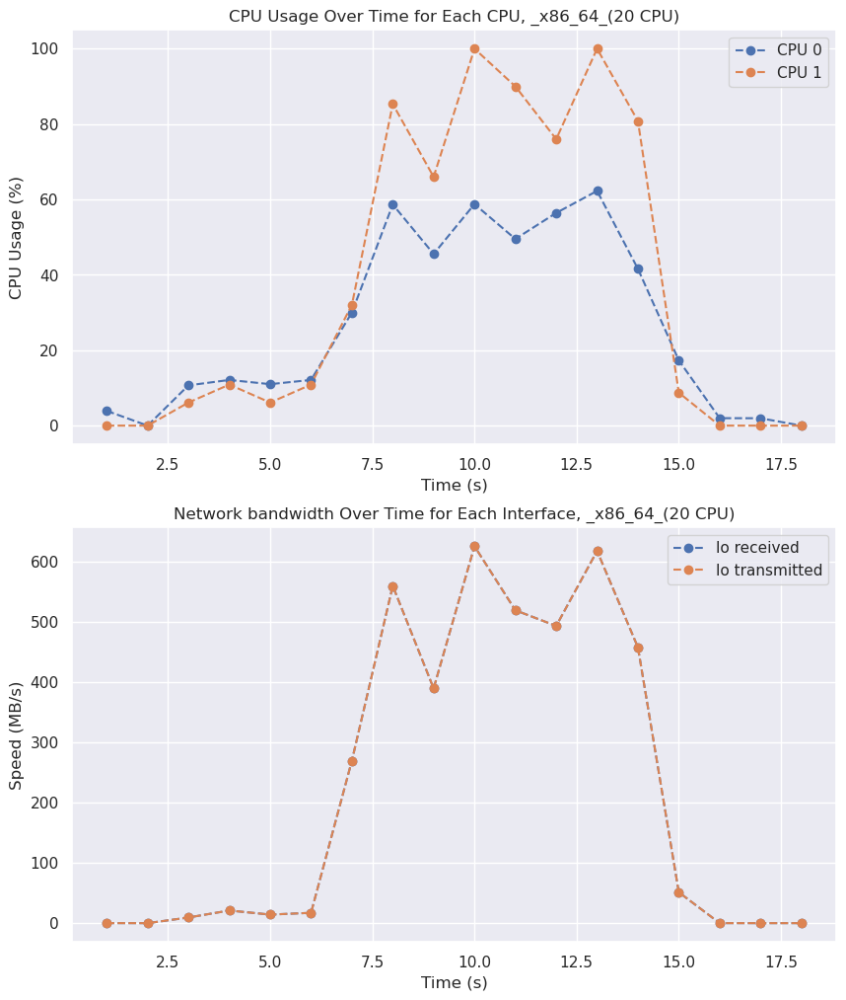
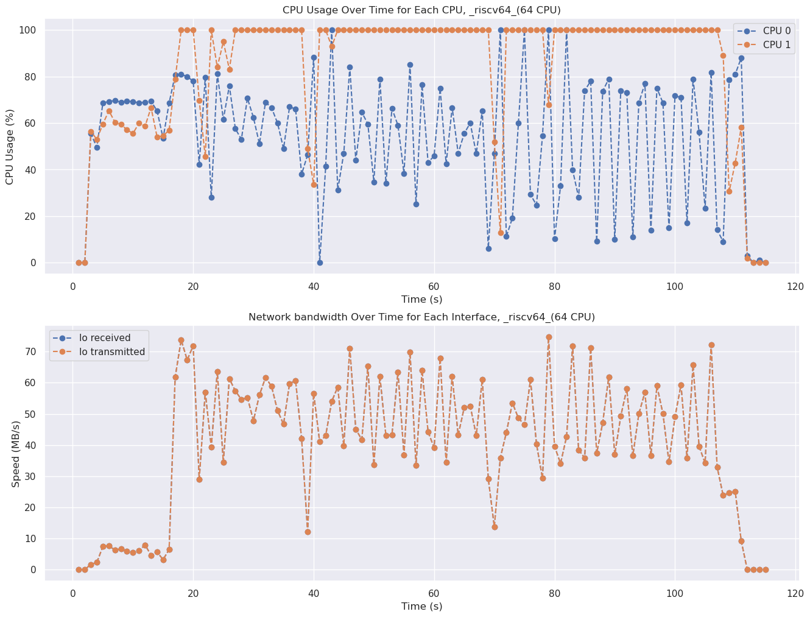

# 每周工作记录

## 11.17 周五

### 已完成工作

1. 学习了sar的使用方法，使用sar监控测试程序的CPU、NetWork、I/O的使用情况。

    整合了一个监控程序，机理比较简单：在每个测试项目开始或者在每次测试迭代开始之前启动监控程序，然后在测试项目结束或者每轮测试迭代结束时关掉。sar将日志打印到指定的目录中，一般为"xx_results/monitor"这个目录下。

2. 用python重写之前的所有shell测试脚本

    个人感觉使用shell处理数据比较痛苦，便学习了python的subprocess模块，并编写了封装了shell命令调用的接口，具体实现在utils/shell.py中。

3. 绘制在运行redis-benchmark的过程中的CPU、NetWork、I/O的状态变化图

    绘制的图位于在"redis/visualization.ipynb"中。

    这里先简单介绍观察到riscv服务器CPU占用率的一些异常情况：

    首先本地X86机器的CPU占用率变化图：

    

    然后后rsicv64机器的CPU占用率变化图：

    

    补充说明，redis服务器运行在CPU0，redis客户端运行在CPU1，rsicv64机器的cpu占用率明显变化更剧烈。

    网络带宽的变化情况和服务器的CPU利用率基本一致。I/O的变化目前没有看出有什么规律。

4. 为了方便，额外写了解析sar日志格式的库函数，位于"monitor/parser.py"，同样封装了图像绘制的函数接口。

5. 在服务器和本地上跑了jvm的性能测试

    CPU占用率的计算似乎有很大的问题，因为jvm会创建十来个线程，不会吃满服务器所有的核心，所以服务器的CPU占用率会很低。同时服务器CPU占用率还在akka_uct测试项目中达到%system占用率超过90%的极端情况。

6. 在服务器上安装了PG数据库，跑了一个简单的数据库测试（甚至暂时没有记录）

### To Do

1. 重新设计JVM测试中cpu占用率的计算，只有用了的核心才被计算

2. 对JVM测试的结果可视化

3. 计划接下来的测试项目
